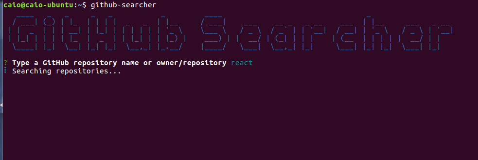
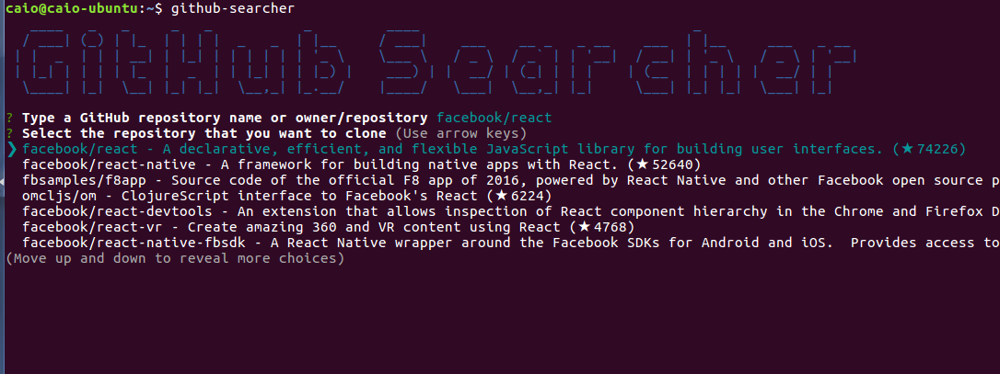
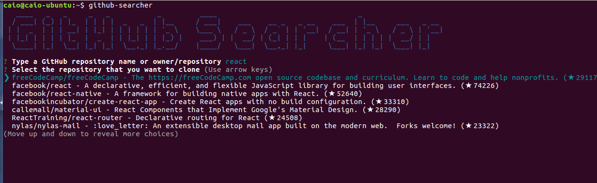

# GitHub Searcher

[](https://www.npmjs.com/package/github-searcher)

A simple CLI searcher/cloner of Github repositories.

## Install
Install via NPM

```sh
$ npm install -g github-searcher
```

or via Git clone

```sh
$ git clone https://github.com/caiofsouza/github-searcher.git
$ cd github-searcher
$ npm install -g
```

## Usage
Type the repository name:



Or owner/repository:



Select the repository that you want to clone:



It will be cloned to the current path:


## LICENSE

MIT © Caio Fernandes.
